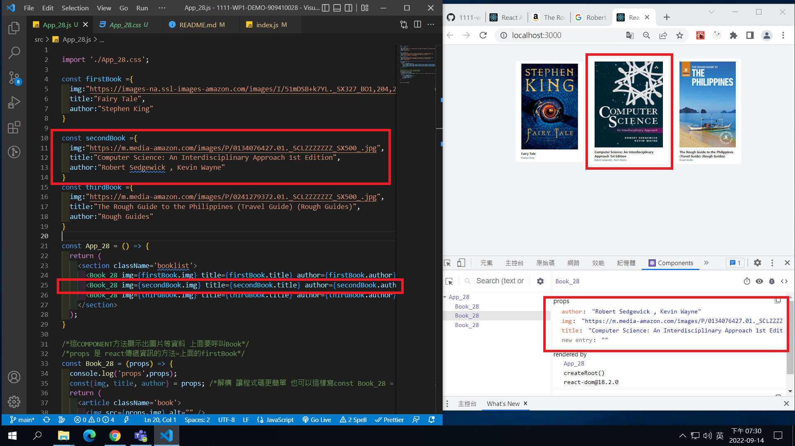
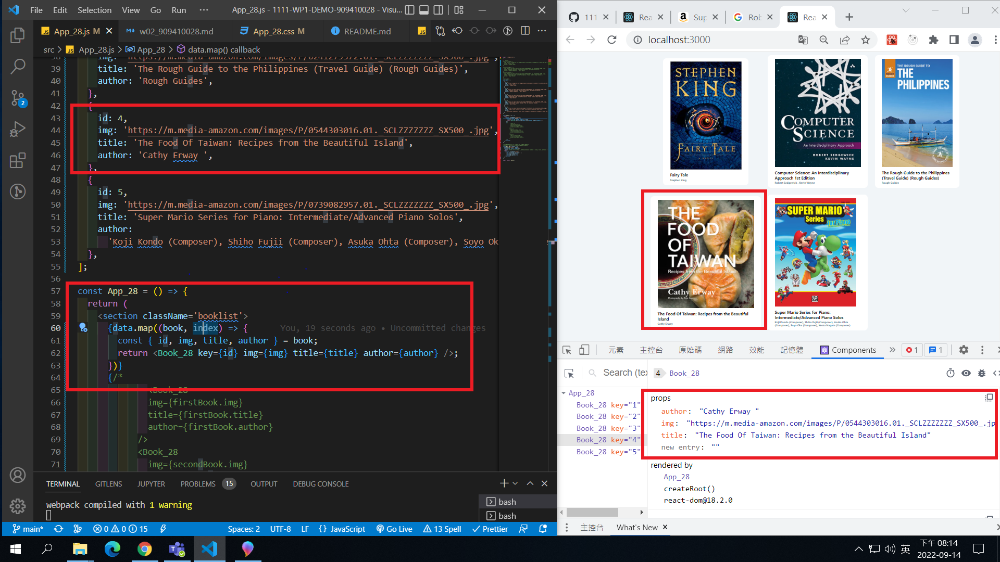

### W02-P1: Add w01 files.

### W02-P2: Add two more books, marked books based on your ID's last digit.

### W02-P3: Add two more books(total = 5 books), marked 4th or 5th books based on your ID's last digit.

### W02-P4: Make components -- Booklist_28.js , Book_28.js , data.js , App_28.js

### W02-P5: copy w02 files to demo/w2_booklist.

