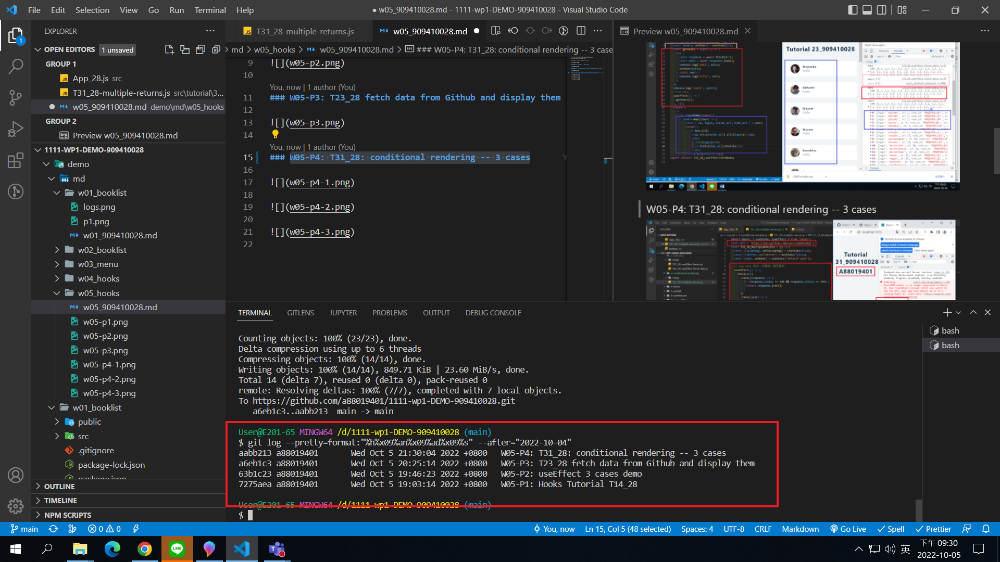

[Github URL](https://github.com/a88019401/1111-wp1-DEMO-909410028.git)

### W05-P1: Hooks Tutorial T14_28


### W05-P2: useEffect 3 cases demo


### W05-P3: T23_28 fetch data from Github and display them


### W05-P4: T31_28: conditional rendering -- 3 cases


### W05-logs: show all four logs done today



```
$ git log --pretty=format:"%h%x09%an%x09%ad%x09%s" --after="2022-10-04"
aabb213 a88019401       Wed Oct 5 21:30:04 2022 +0800   W05-P4: T31_28: conditional rendering -- 3 cases
a6eb1c3 a88019401       Wed Oct 5 20:25:14 2022 +0800   W05-P3: T23_28 fetch data from Github and display them
63b1c23 a88019401       Wed Oct 5 19:46:23 2022 +0800   W05-P2: useEffect 3 cases demo
7275aea a88019401       Wed Oct 5 19:03:14 2022 +0800   W05-P1: Hooks Tutorial T14_28


```
