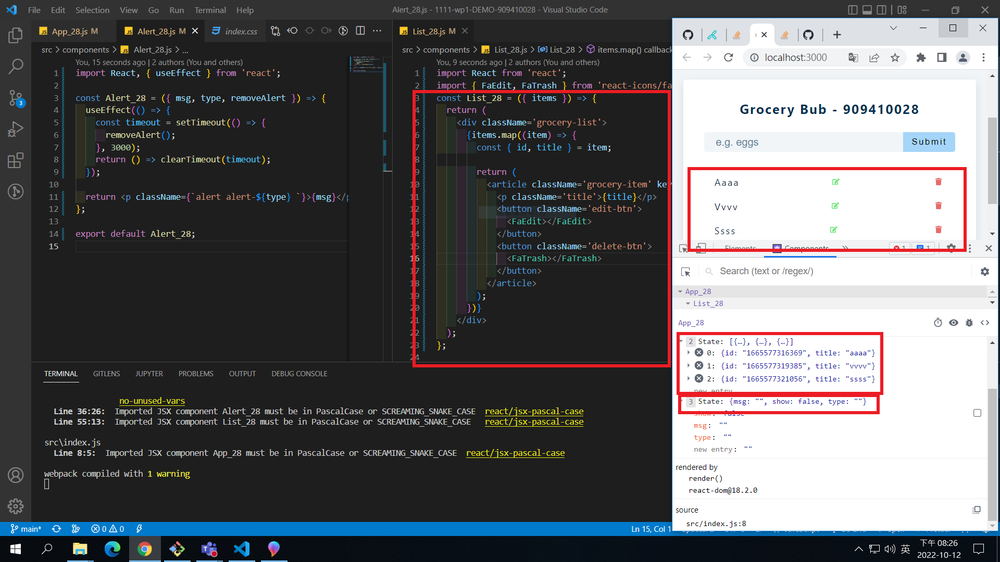
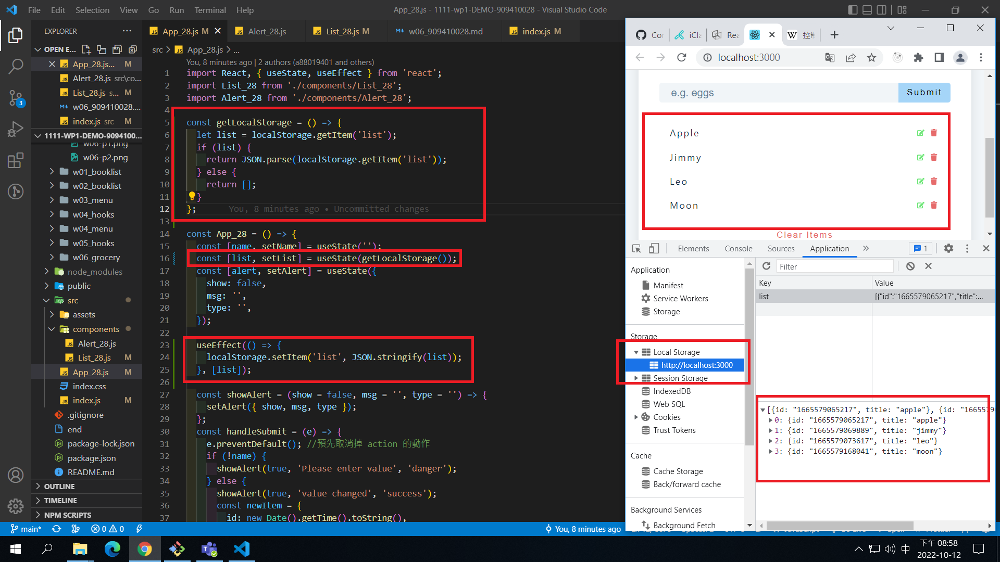
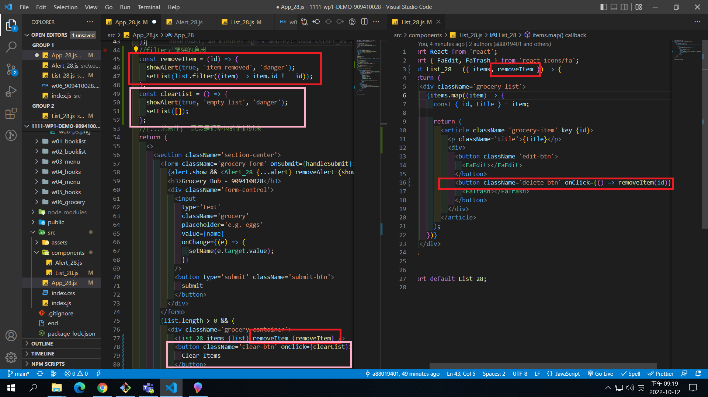
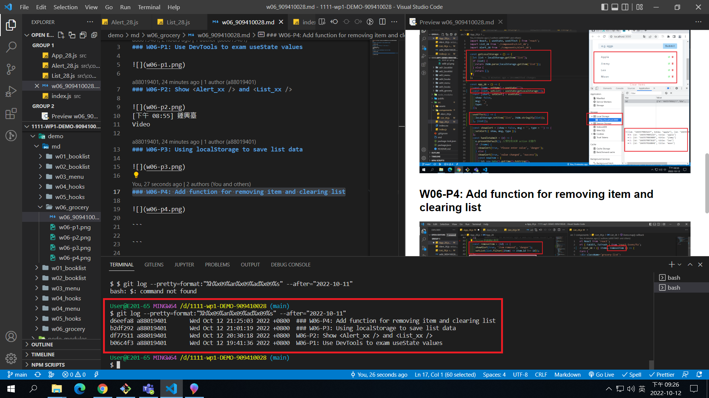

[Github URL](https://github.com/a88019401/1111-wp1-DEMO-909410028.git)

### W06-P1: Use DevTools to exam useState values


### W06-P2: Show <Alert_xx /> and <List_xx />


[下午 08:55] 鍾興臺
Video

### W06-P3: Using localStorage to save list data



### W06-P4: Add function for removing item and clearing list



### W06-logs: show all four logs done today



```
$ git log --pretty=format:"%h%x09%an%x09%ad%x09%s" --after="2022-10-11"
d6eefa8 a88019401       Wed Oct 12 21:25:03 2022 +0800  ### W06-P4: Add function for removing item and clearing list
b2df292 a88019401       Wed Oct 12 21:01:19 2022 +0800  ### W06-P3: Using localStorage to save list data
df77511 a88019401       Wed Oct 12 20:30:18 2022 +0800  W06-P2: Show <Alert_xx /> and <List_xx />
b06c4f3 a88019401       Wed Oct 12 19:41:36 2022 +0800  W06-P1: Use DevTools to exam useState values
```
