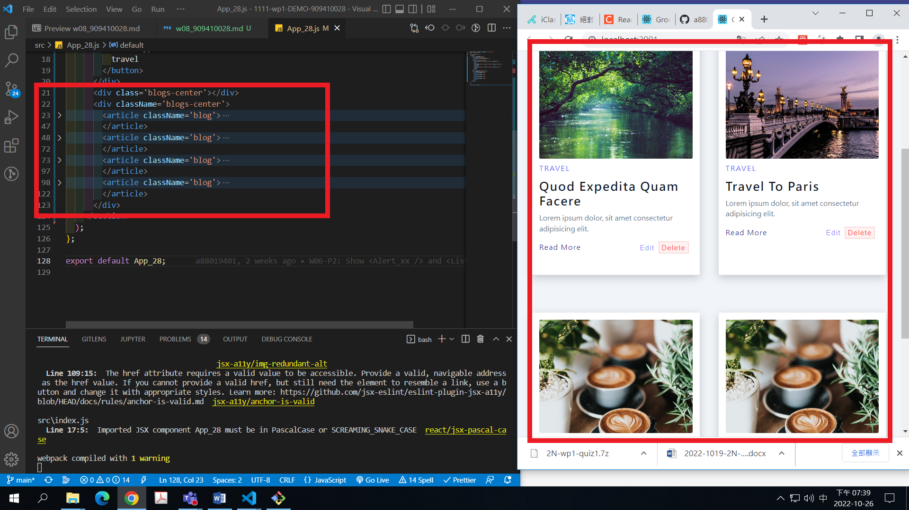
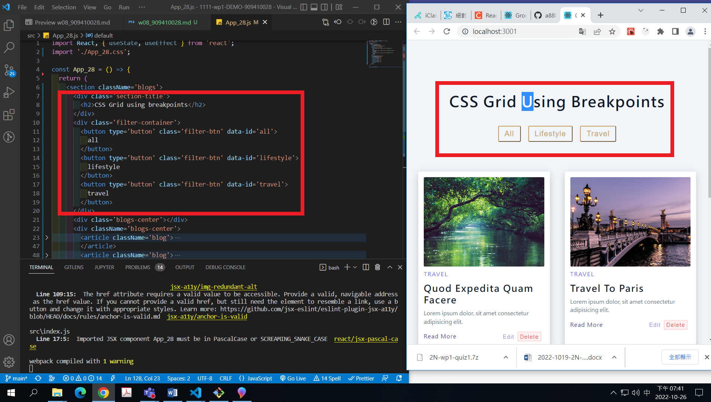
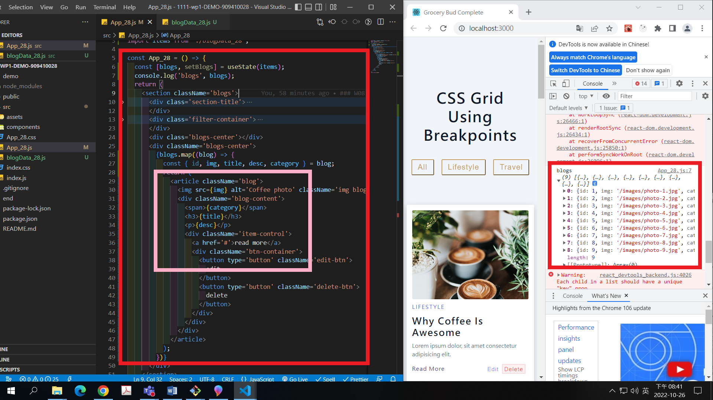

[Github URL](https://github.com/a88019401/1111-wp1-DEMO-909410028.git)

### W08-P1:a. 依學號從後往前，顯示對應的四筆 blog，結果圖片請參考 w01-p1.png; b. 顯示 filter 篩選按鈕，結果圖片請參考 w03-p1.png

    ### W08-P2: 請將9筆 blogs資訊放入陣列 blogData_xx.js中，並能套入第1題的 App_xx.js 中，要能顯示所有的blogs

