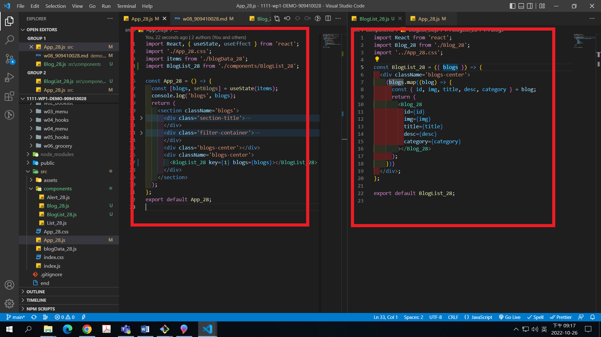
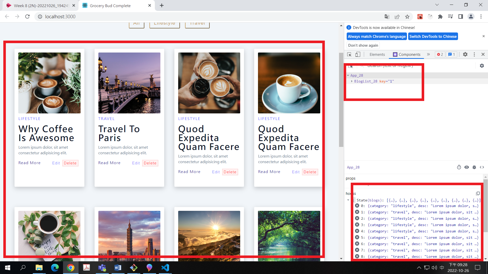
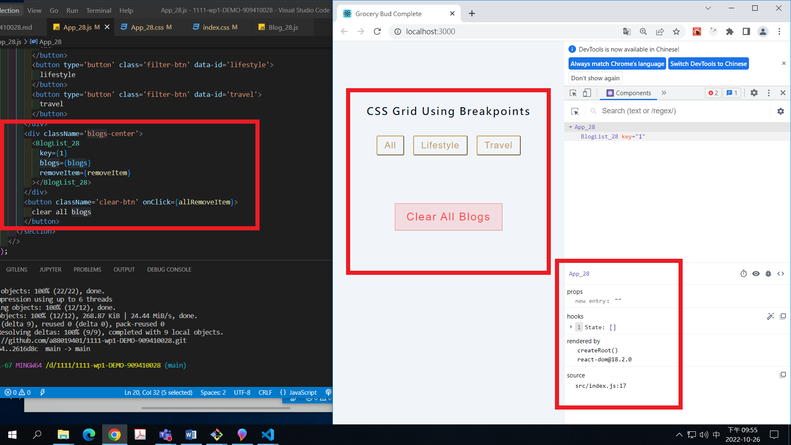
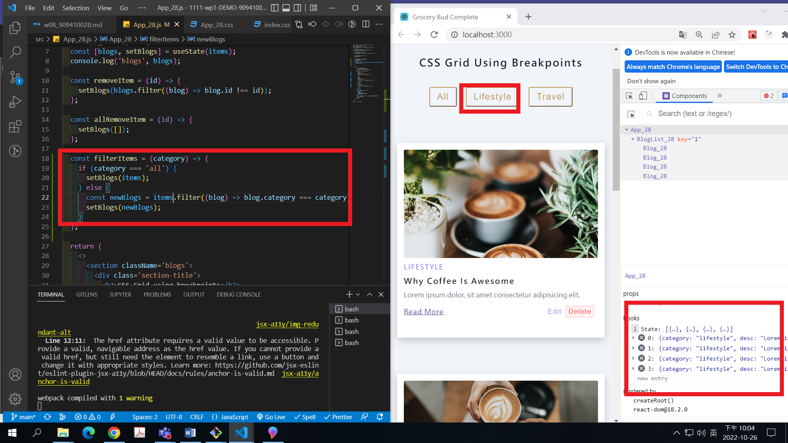
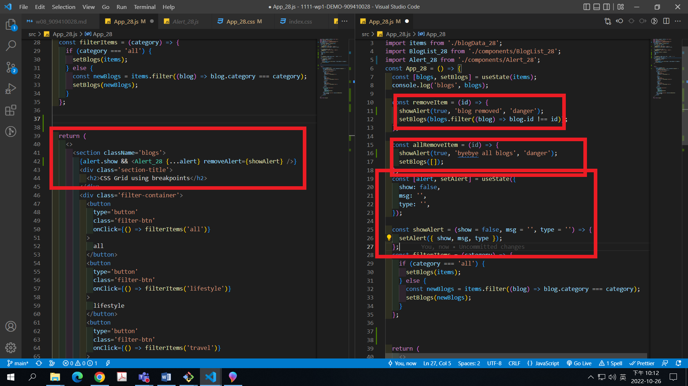
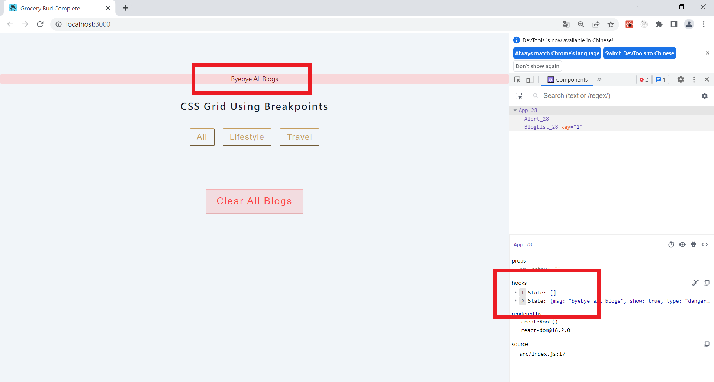
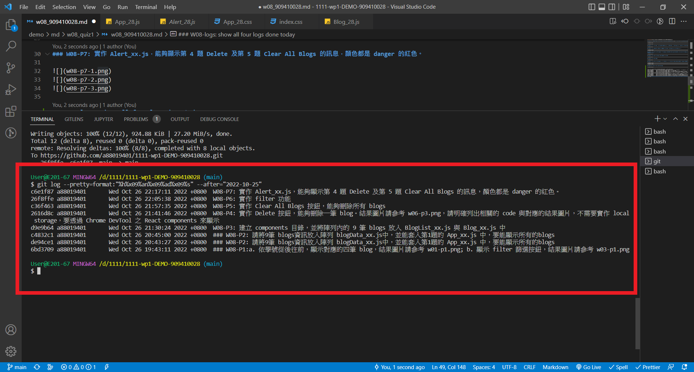

[Github URL](https://github.com/a88019401/1111-wp1-DEMO-909410028.git)

### W08-P1:a. 依學號從後往前，顯示對應的四筆 blog，結果圖片請參考 w01-p1.png; b. 顯示 filter 篩選按鈕，結果圖片請參考 w03-p1.png


### W08-P2: 請將 9 筆 blogs 資訊放入陣列 blogData_xx.js 中，並能套入第 1 題的 App_xx.js 中，要能顯示所有的 blogs


### W08-P3: 建立 components 目錄，並將陣列內的 9 筆 blogs 放入 BlogList_xx.js 與 Blog_xx.js 中




### W08-P4: 實作 Delete 按鈕，能夠刪除一筆 blog。結果圖片請參考 w06-p3.png，請明確列出相關的 code 與對應的結果圖片，不需要實作 local storage，要透過 Chrome DevTool 之 React components 來顯示


### W08-P5: 實作 Clear All Blogs 按鈕，能夠刪除所有 blogs



### W08-P6: 實作 filter 功能



### W08-P7: 實作 Alert_xx.js，能夠顯示第 4 題 Delete 及第 5 題 Clear All Blogs 的訊息，顏色都是 danger 的紅色。





### W08-logs: show all four logs done today



```
$ git log --pretty=format:"%h%x09%an%x09%ad%x09%s" --after="2022-10-25"
c6e1f87 a88019401       Wed Oct 26 22:17:11 2022 +0800  W08-P7: 實作 Alert_xx.js，能夠顯示第 4 題 Delete 及第 5 題 Clear All Blogs 的訊息，顏色都是 danger 的紅色。
26f8ffe a88019401       Wed Oct 26 22:05:38 2022 +0800  W08-P6: 實作 filter 功能
c36f463 a88019401       Wed Oct 26 21:57:35 2022 +0800  W08-P5: 實作 Clear All Blogs 按鈕，能夠刪除所有 blogs
2616d8c a88019401       Wed Oct 26 21:41:46 2022 +0800  W08-P4: 實作 Delete 按鈕，能夠刪除一筆 blog。結果圖片請參考 w06-p3.png，請明確列出相關的 code 與對應的結果圖片，不需要實作 local storage，要透過 Chrome DevTool 之 React components 來顯示
d9e9b64 a88019401       Wed Oct 26 21:30:24 2022 +0800  W08-P3: 建立 components 目錄，並將陣列內的 9 筆 blogs 放入 BlogList_xx.js 與 Blog_xx.js 中
c4832c1 a88019401       Wed Oct 26 20:45:00 2022 +0800  ### W08-P2: 請將9筆 blogs資訊放入陣列 blogData_xx.js中，並能套入第1題的 App_xx.js 中，要能顯示所有的blogs
de94ce1 a88019401       Wed Oct 26 20:43:27 2022 +0800  ### W08-P2: 請將9筆 blogs資訊放入陣列 blogData_xx.js中，並能套入第1題的 App_xx.js 中，要能顯示所有的blogs
6bd3709 a88019401       Wed Oct 26 19:43:11 2022 +0800  ### W08-P1:a. 依學號從後往前，顯示對應的四筆 blog，結果圖片請參考 w01-p1.png; b. 顯示 filter 篩選按鈕，結果圖片請參考 w03-p1.png
```
