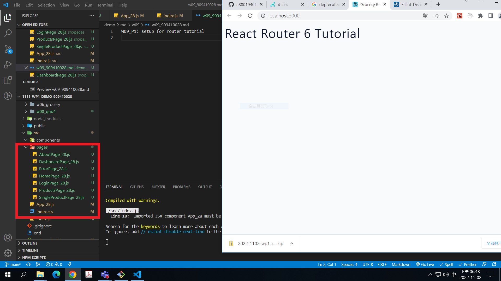
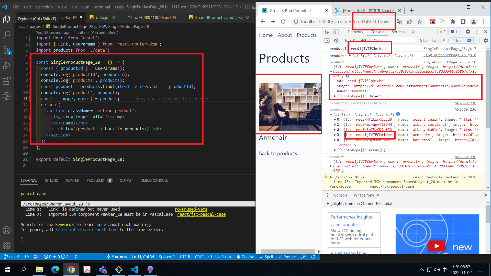
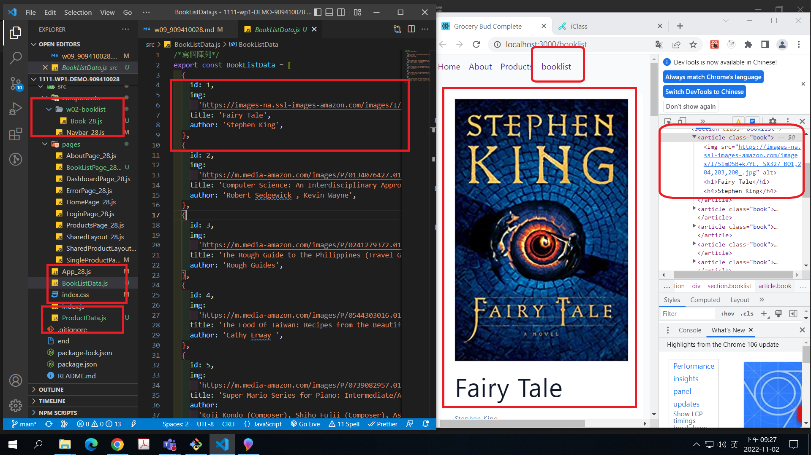
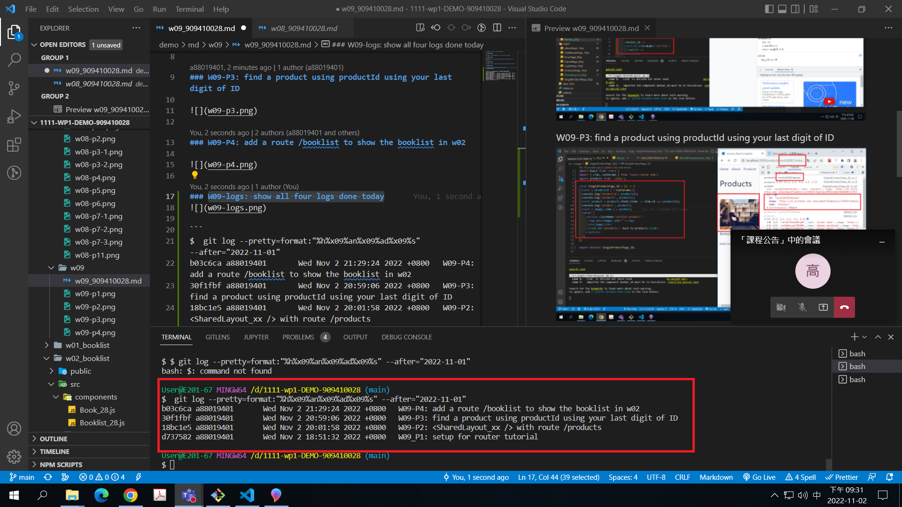

[Github URL](https://github.com/a88019401/1111-wp1-DEMO-909410028.git)

### W09_P1: setup for router tutorial



### W09-P2: <SharedLayout_xx /> with route /products


### W09-P3: find a product using productId using your last digit of ID



### W09-P4: add a route /booklist to show the booklist in w02



### W09-logs: show all four logs done today



```
$  git log --pretty=format:"%h%x09%an%x09%ad%x09%s" --after="2022-11-01"
b03c6ca a88019401       Wed Nov 2 21:29:24 2022 +0800   W09-P4: add a route /booklist to show the booklist in w02
30f1fbf a88019401       Wed Nov 2 20:59:06 2022 +0800   W09-P3: find a product using productId using your last digit of ID
18bc1e5 a88019401       Wed Nov 2 20:01:58 2022 +0800   W09-P2: <SharedLayout_xx /> with route /products
d737582 a88019401       Wed Nov 2 18:51:32 2022 +0800   W09_P1: setup for router tutorial
```
