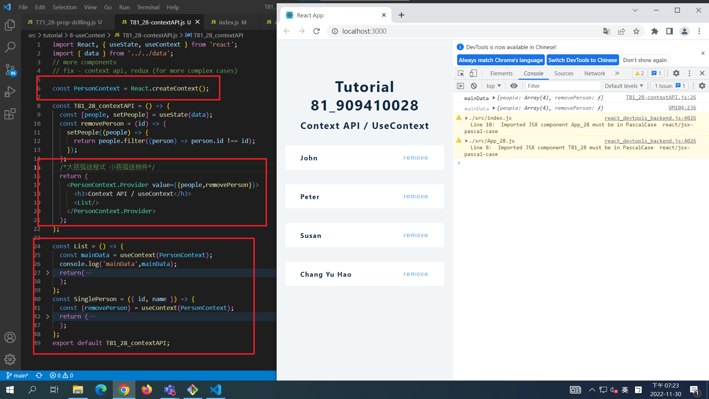
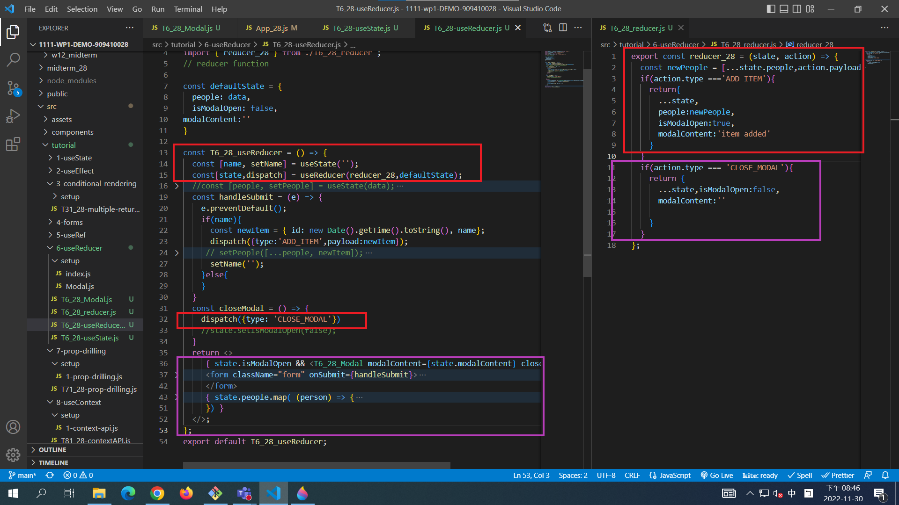

[Github URL](https://github.com/a88019401/1111-wp1-DEMO-909410028.git)


### W13-P1: PersonContext for T82_28




### W13-P2: Apply useReducer to add an item with modal alert



### W13-P3: Apply useContext to solve quiz 1 problem with prop drilling


### W13-logs: show all four logs done today


``` git log --pretty=format:"%h%x09%an%x09%ad%x09%s" --after="2022-11-29" 
6e66531 a88091401       Wed Nov 30 21:59:33 2022 +0800  ### W13-P3: Apply useContext to solve quiz 1 problem with prop drilling
4f68c2c a88091401       Wed Nov 30 20:49:49 2022 +0800  ### W13-P2: Apply useReducer to add an item with modal alert
c30b713 a88091401       Wed Nov 30 19:30:08 2022 +0800  ### W13-P1: PersonContext for T82_28
e36de18 a88091401       Wed Nov 30 19:29:57 2022 +0800  ### W13-P1: PersonContext for T82_28```