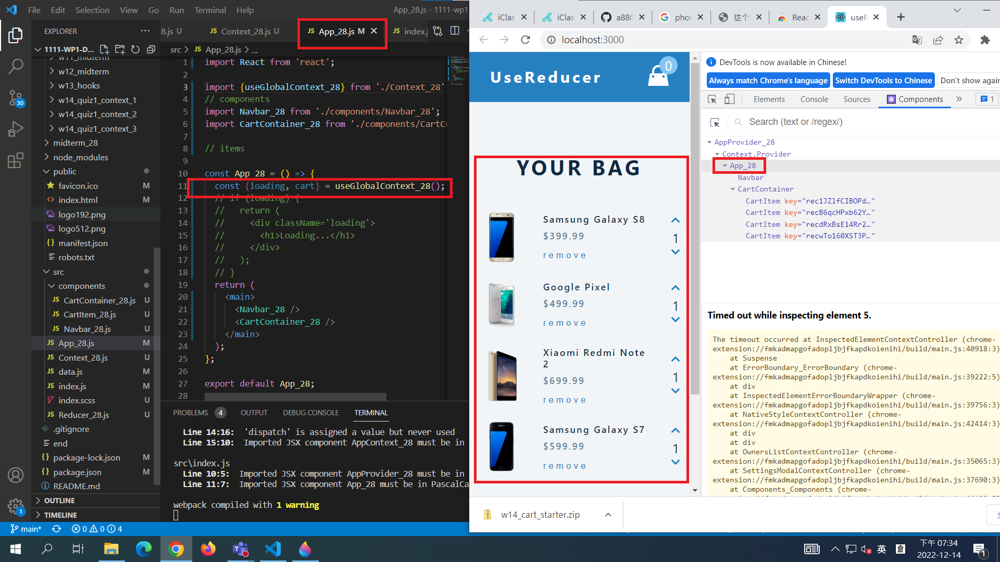
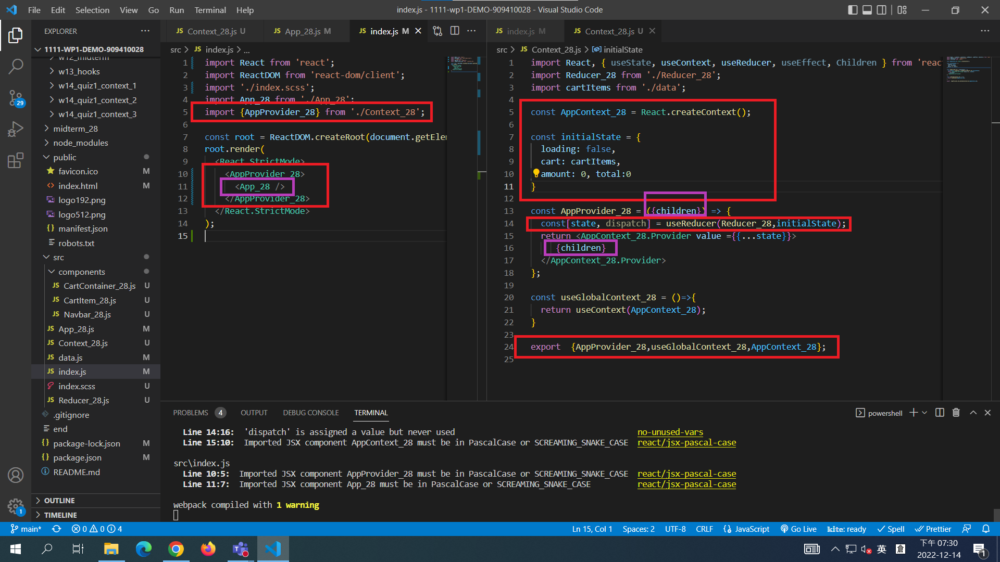
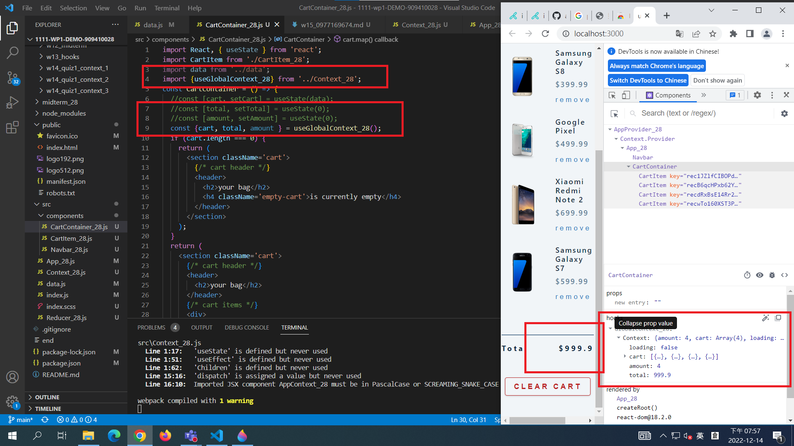
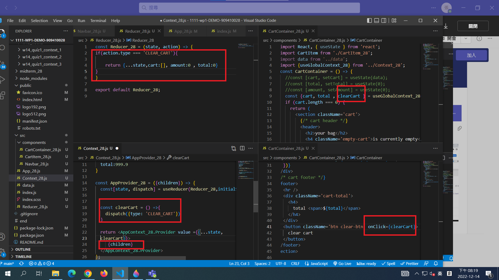
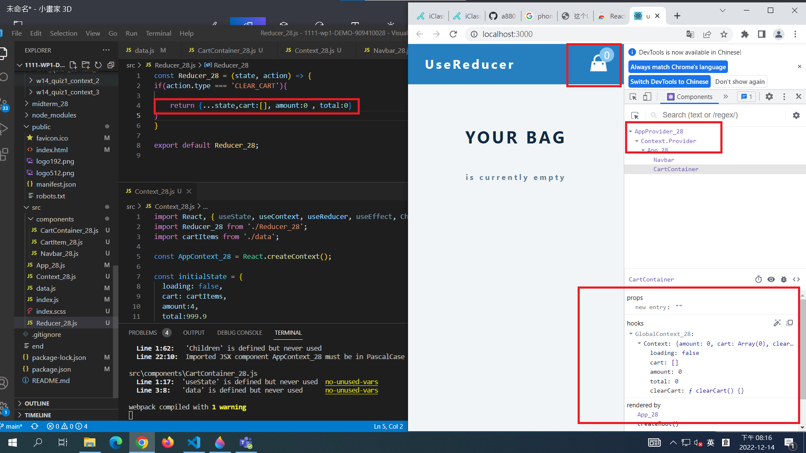
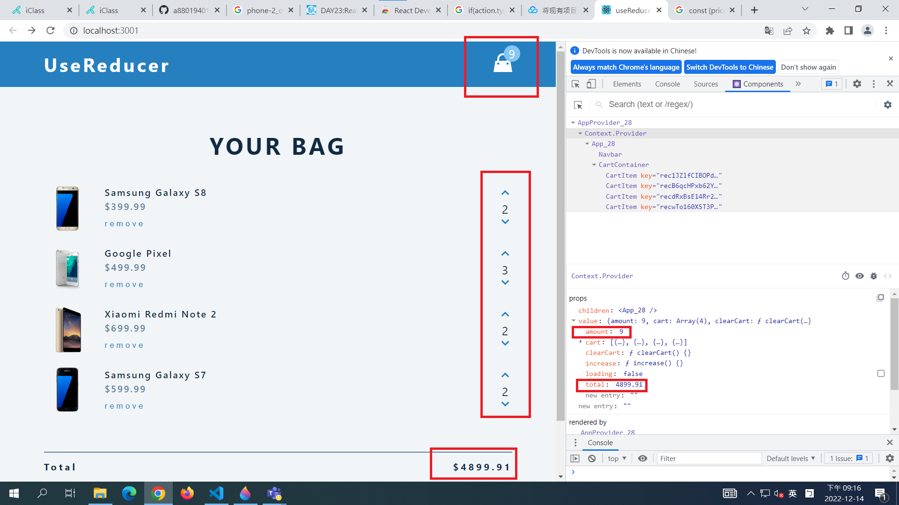
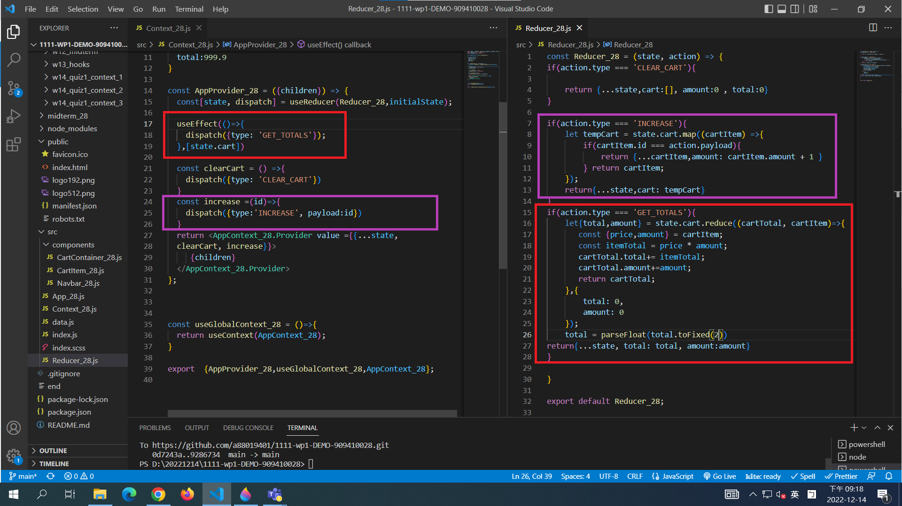
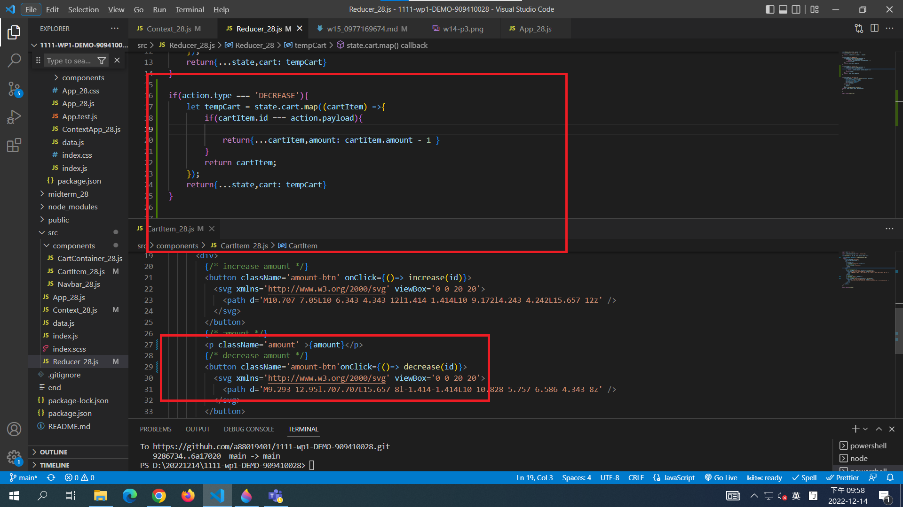
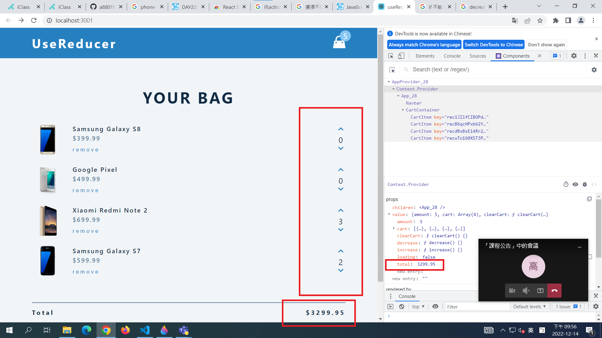
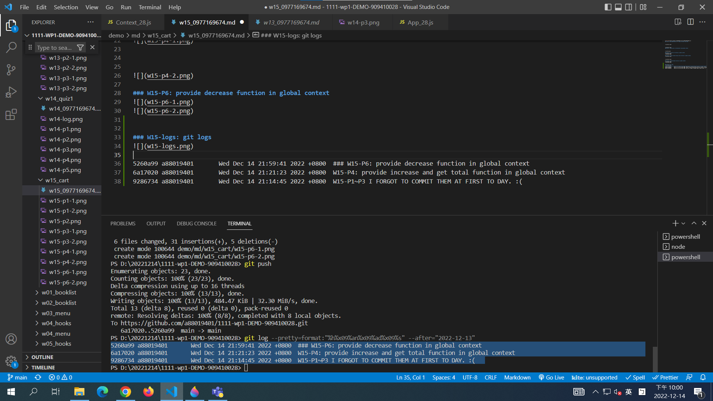

[Github URL](https://github.com/a88019401/1111-wp1-DEMO-909410028.git)
### W15-P1: Setup AppProvider_xx for App_xx and get state data

### W15-P2: replace data in CartContainer using global context

 

### W15-P3: put clear cart function in global context

### W15-P4: provide increase and get total function in global context

 

### W15-P6: provide decrease function in global context

### W15-logs: git logs

5260a99 a88019401       Wed Dec 14 21:59:41 2022 +0800  ### W15-P6: provide decrease function in global context
6a17020 a88019401       Wed Dec 14 21:21:23 2022 +0800  W15-P4: provide increase and get total function in global context
9286734 a88019401       Wed Dec 14 21:14:45 2022 +0800  W15-P1~P3 I FORGOT TO COMMIT THEM AT FIRST TO DAY. :(